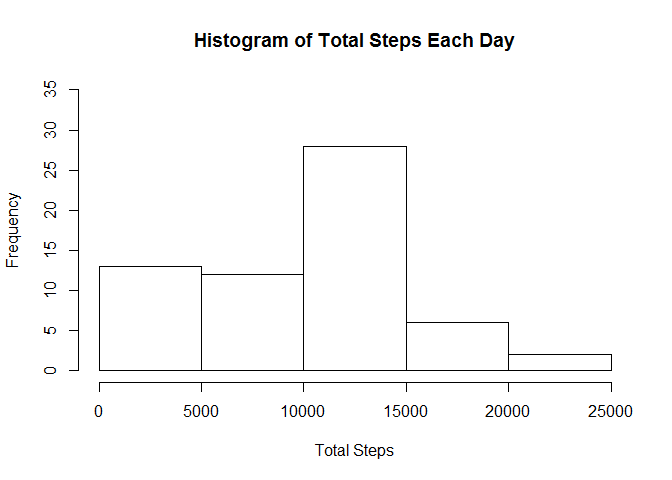
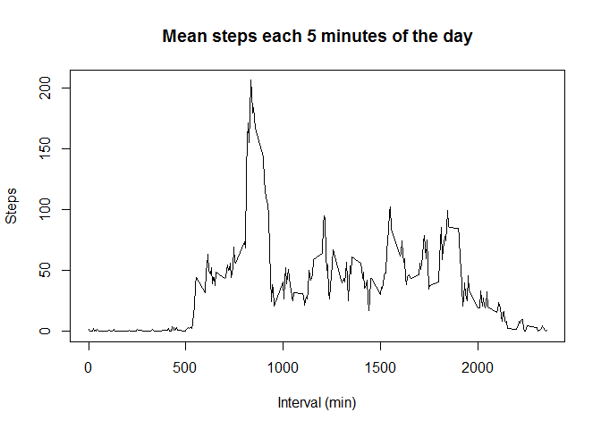
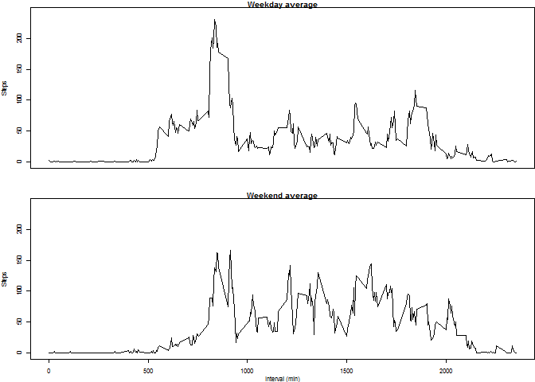

# Peer-graded Assignment
areeves  
July 9, 2017  


## Loading and preprocessing the data

<!-- Show any code that is needed to -->

<!-- Load the data (i.e. read.csv()) -->
<!-- Process/transform the data (if necessary) into a format suitable for your analysis -->
Loaded and transformed the csv with the following code:

```r
d<-read.csv("activity.csv")
d$date<-as.Date(as.character(d$date),"%Y-%m-%d")
```


## What is mean total number of steps taken per day?

<!-- For this part of the assignment, you can ignore the missing values in the dataset. -->

<!-- Calculate the total number of steps taken per day -->
<!-- If you do not understand the difference between a histogram and a barplot, research the difference between them. Make a histogram of the total number of steps taken each day -->
<!-- Calculate and report the mean and median of the total number of steps taken per day -->

Calculate total steps by date and store in variable "daily.steps".
Plot histogram of daily.steps.

```r
daily.steps<-tapply(d$steps,d$date,sum,na.rm=TRUE)
hist(daily.steps,ylim=c(0,35),main="Histogram of Total Steps Each Day",
     xlab="Total Steps")
```

<!-- -->
  
The mean and median daily steps are:

```r
mean(daily.steps)
```

```
## [1] 9354.23
```

```r
median(daily.steps)
```

```
## [1] 10395
```


## What is the average daily activity pattern?

<!-- Make a time series plot (i.e. type = "l") of the 5-minute interval (x-axis) and the average number of steps taken, averaged across all days (y-axis) -->
<!-- Which 5-minute interval, on average across all the days in the dataset, contains the maximum number of steps? -->
Time-series of the mean number of steps taken by 5-minute interval.

```r
interval.steps<-tapply(d$steps,d$interval,mean,na.rm=TRUE)
plot(names(interval.steps),interval.steps,type="l",
     xlab = "Interval (min)", ylab = "Steps", 
     main = "Mean steps each 5 minutes of the day")
```

<!-- -->

The 5-minute interval that contains the maximum number of steps is:

```r
names(interval.steps)[which.max(interval.steps)]
```

```
## [1] "835"
```


## Imputing missing values

<!-- Note that there are a number of days/intervals where there are missing values (coded as NA). The presence of missing days may introduce bias into some calculations or summaries of the data. -->

<!-- Calculate and report the total number of missing values in the dataset (i.e. the total number of rows with NAs) -->
<!-- Devise a strategy for filling in all of the missing values in the dataset. The strategy does not need to be sophisticated. For example, you could use the mean/median for that day, or the mean for that 5-minute interval, etc. -->
<!-- Create a new dataset that is equal to the original dataset but with the missing data filled in. -->
<!-- Make a histogram of the total number of steps taken each day and Calculate and report the mean and median total number of steps taken per day. Do these values differ from the estimates from the first part of the assignment? What is the impact of imputing missing data on the estimates of the total daily number of steps? -->
The number of incomplete rows in the dataset is

```r
sum(!complete.cases(d))
```

```
## [1] 2304
```
The missing data were imputed with the following code.

```r
d.imp<-d
d.imp$steps<- sapply(1:nrow(d),function(i) ifelse(is.na(d[i,1]), interval.steps[names(interval.steps)==d[i,3]], d[i,1]) )
```

Histogram of the daily step total with imputed data:

```r
daily.steps.imp<-tapply(d.imp$steps,d.imp$date,sum,na.rm=TRUE)
hist(daily.steps.imp,ylim=c(0,35),main = "Histogram of Imputed Total
     Daily Steps", xlab = "Daily Steps")
```

<!-- -->


The mean and median daily steps are:

```r
mean(daily.steps.imp)
```

```
## [1] 10766.19
```

```r
median(daily.steps.imp)
```

```
## [1] 10766.19
```

The histogram and mean both show a shift toward the median relative to the non-imputed data. In other words, there is less skew. This makes sense since we used a mean-based calculation to impute missing data.


##Are there differences in activity patterns between weekdays and weekends?

<!-- For this part the weekdays() function may be of some help here. Use the dataset with the filled-in missing values for this part. -->

<!-- Create a new factor variable in the dataset with two levels - "weekday" and "weekend" indicating whether a given date is a weekday or weekend day. -->
<!-- Make a panel plot containing a time series plot (i.e. type = "l") of the 5-minute interval (x-axis) and the average number of steps taken, averaged across all weekday days or weekend days (y-axis). See the README file in the GitHub repository to see an example of what this plot should look like using simulated data. -->

Create new factor variable for weekday vs weekend. Calculate mean number of steps by 5 minute interval and weekday/end. Store result in matrix "m".

```r
d.imp$day<-weekdays(d.imp$date)
d.imp$day<-as.factor(d.imp$day)
levels(d.imp$day)<-list(
        "weekday" = c("Monday","Tuesday","Wednesday","Thursday", "Friday"), 
        "weekend" = c("Saturday","Sunday"))
m<-tapply(d.imp$steps,list(d.imp$interval,d.imp$day),mean)
```

Make a panel plot of weekday and weekend step activity by 5 minute interval.

```r
par(mfrow=c(2,1),mar=c(3, 4, 1, 0), cex=0.5)
plot(rownames(m),m[,1],
              main="Weekday average",
              xlab="", xaxt='n',
              ylab="Steps", ylim = c(0,240),
              type="l")
par(mar=c(3,4,1,0))
plot(rownames(m),m[,2],
              main="Weekend average",
              xlab="",
              ylab="Steps", ylim = c(0,240),
              type="l")
title(xlab="Interval (min)",line=2,cex.lab=1)
```

<!-- -->
